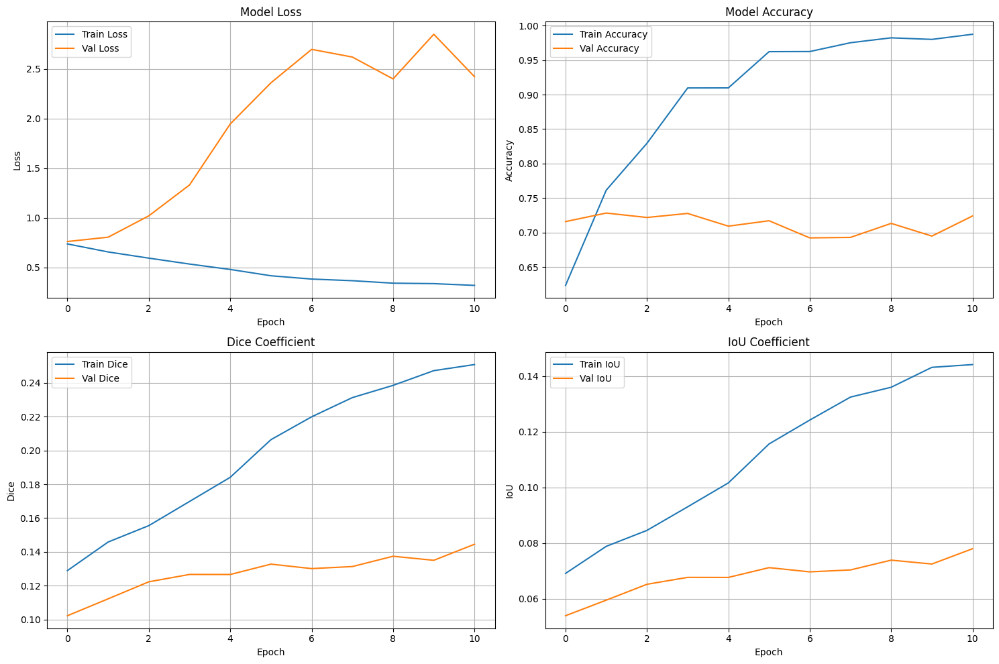
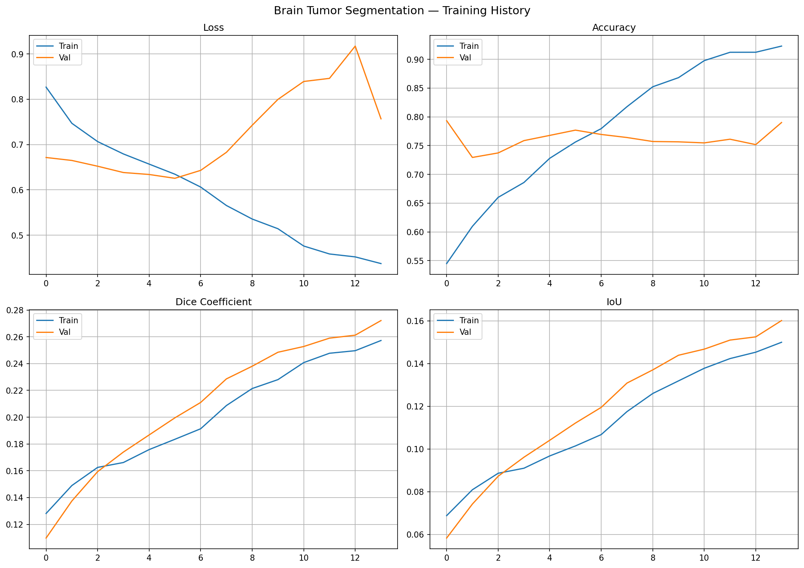
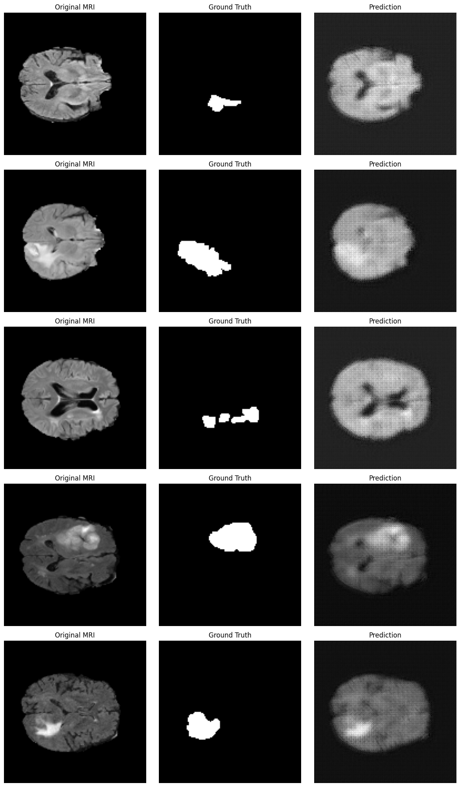
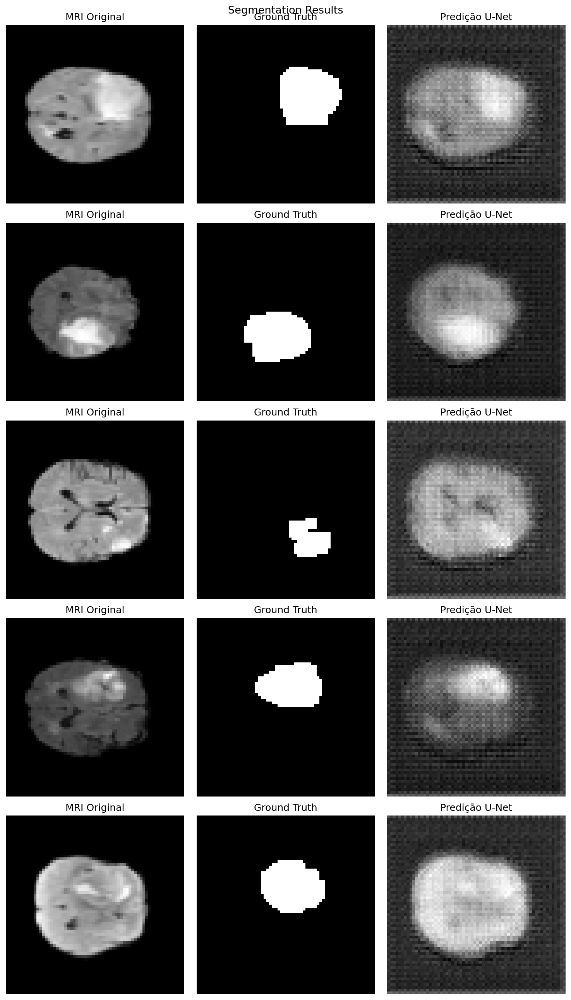

# 🧠 Brain Tumor Segmentation using U-Net

<div align="center">


*Automated brain tumor segmentation in MRI images using deep learning*

[View Results](#results) · [Report Bug](https://github.com/jauilson/brain-tumor-segmentation/issues) · [Request Feature](https://github.com/jauilson/brain-tumor-segmentation/issues)

</div>

---

## 📋 Table of Contents

- [About](#about)
- [Key Features](#key-features)
- [Repository Structure](#repository-structure)
- [Dataset](#dataset)
- [Model Architecture](#model-architecture)
- [Hardware & Compatibility](#hardware--compatibility)
- [Installation](#installation)
- [Usage](#usage)
- [Results](#results)
- [Project Context](#project-context)
- [Future Work](#future-work)
- [Author](#author)
- [References](#references)

---

## 🎯 About

This project implements an automated brain tumor segmentation system using the **U-Net** deep learning architecture, trained on the **BraTS 2019** dataset (484 multi-modal MRI scans).

### Why This Matters

- **Clinical Impact:** Automated segmentation reduces manual annotation time and inter-observer variability
- **Treatment Planning:** Precise tumor boundaries are critical for radiation therapy and surgical planning
- **Research Value:** Enables large-scale quantitative analysis of brain tumors
- **Educational Purpose:** Practical application of deep learning in medical imaging

---

## ✨ Key Features

- **U-Net Architecture** — Encoder-decoder with skip connections for medical image segmentation
- **BraTS 2019 Dataset** — 484 multi-modal MRI scans (T1, T1c, T2, FLAIR)
- **Two Implementations** — Original (GPU/reference) and Optimized v3 (CPU/Keras 3)
- **Comprehensive Metrics** — Dice coefficient, IoU, and pixel accuracy
- **Drive Retry Mechanism** — Automatic recovery from Google Drive I/O instability
- **Memory Efficient** — float32 loading, immediate GC, reduced model footprint

---

## 📁 Repository Structure

```
brain-tumor-segmentation/
│
├── brain_tumor_segmentation.ipynb           # Original notebook (GPU / reference)
├── Brain_tumor_segmentation_optimized.ipynb # Optimized version (CPU / Keras 3)
├── requirements.txt
├── .gitignore
├── LICENSE
├── README.md
└── results/                                 # Generated after training
    ├── training_history.png
    ├── segmentation_results.png
    └── best_unet_model.keras
```

### Which file should I use?

| File | When to use |
|------|-------------|
| `brain_tumor_segmentation.ipynb` | GPU available, TF < 2.16, reference study |
| `Brain_tumor_segmentation_optimized.ipynb` | CPU-only, TF 2.16+ / Keras 3, Google Colab 2025 |

---

## 📊 Dataset

### BraTS 2019 — Brain Tumor Segmentation Challenge

| Property | Value |
|----------|-------|
| Source | [MICCAI / UPenn](https://www.med.upenn.edu/sbia/brats2019/data.html) |
| Training cases | 484 |
| Validation cases | 66 |
| MRI modalities | T1, T1-contrast, T2, FLAIR |
| Format | NIfTI (.nii.gz) |
| Volume shape | (240, 240, 155, 4) — 4D multi-modal |
| Labels | Background, Necrotic/Non-enhancing, Edema, Enhancing tumor |

### Preprocessing Pipeline

1. **4D → 3D:** Select T1 modality (channel 0) from 4-channel volume
2. **Slice extraction:** Central axial slice (depth // 2)
3. **Normalization:** Min-max to [0, 1] range, float32
4. **Resize:** 128×128 (GPU) or 64×64 (CPU)
5. **Binarization:** Labels → tumor (1) vs background (0)

> **Important:** BraTS 2019 volumes are 4D `(240, 240, 155, 4)`. The original code assumed 3D input — this was the root cause of the `output_shape length cannot be smaller than the image number of dimensions` error. The optimized version handles both 3D and 4D volumes automatically.

---

## 🏗️ Model Architecture

### U-Net — Encoder-Decoder with Skip Connections

```
Input (128x128x1 or 64x64x1)
    │
    ├── Encoder Block 1 ──────────────────────────────────┐ skip
    │       ↓ MaxPool                                      │
    ├── Encoder Block 2 ────────────────────────────────┐ │ skip
    │       ↓ MaxPool                                    │ │
    ├── Encoder Block 3 ──────────────────────────────┐ │ │ skip
    │       ↓ MaxPool                                  │ │ │
    ├── Encoder Block 4 ──────────────────────────┐   │ │ │ skip
    │       ↓ MaxPool                              │   │ │ │
    ├── Bottleneck                                 │   │ │ │
    │       ↓ Conv2DTranspose                      │   │ │ │
    ├── Decoder Block 1 ←──────────────────── cat──┘   │ │ │
    │       ↓ Conv2DTranspose                           │ │ │
    ├── Decoder Block 2 ←──────────────────── cat───────┘ │ │
    │       ↓ Conv2DTranspose                              │ │
    ├── Decoder Block 3 ←──────────────────── cat──────────┘ │
    │       ↓ Conv2DTranspose                                 │
    ├── Decoder Block 4 ←──────────────────── cat─────────────┘
    │
    └── Output Conv2D (1, sigmoid)
```

### Model Variants

| Parameter | Original | Optimized v3 |
|-----------|----------|--------------|
| Encoder filters | 64 → 128 → 256 → 512 | 32 → 64 → 128 → 256 |
| Bottleneck filters | 1024 | 512 |
| Total parameters | ~31M | ~7.8M |
| Input resolution | 128×128 | 64×64 |
| Target hardware | GPU | CPU / any |

Each encoder/decoder block uses: `Conv2D → BatchNorm → Conv2D → BatchNorm`

---

## 💻 Hardware & Compatibility

This project was developed across two environments, which directly motivated the optimized version.

### Google Colab (cloud training)

| Component | Value |
|-----------|-------|
| CPU | 2 virtual cores |
| RAM | 13.6 GB |
| GPU | None (CPU-only session) |
| TensorFlow | 2.19.0 |
| Keras | 3.13.2 |

### Local Development Machine

| Component | Value |
|-----------|-------|
| CPU | Intel Core i5-1235U (12th Gen) |
| Physical cores | 10 (2 P-cores + 8 E-cores) |
| Logical CPUs | 12 (HyperThreading) |
| Max frequency | 4.4 GHz |
| L3 cache | 12 MiB |
| GPU | Integrated Intel Iris Xe (no CUDA) |
| OS | Debian Linux |

> The i5-1235U supports **AVX2** and **FMA** instructions, which TensorFlow uses automatically for vectorized float32 convolution operations — no code changes needed.

### Bugs Fixed in Optimized Version

| Error | Root Cause | Fix Applied |
|-------|-----------|-------------|
| `output_shape length cannot be smaller than image dimensions` | 4D volume (240,240,155,4) passed to 2D resize | Added `if len(shape)==4: volume = volume[:,:,:,0]` |
| `[Errno 103] Software caused connection abort` | Google Drive FUSE instability during NIfTI read | Retry mechanism: 3 attempts, 2s delay |
| `TypeError: fit() got unexpected argument 'workers'` | Keras 3 removed `workers` for numpy array inputs | Parameter removed |
| Yellow underline on `tensorflow.keras` imports | TF 2.16+ migrated to standalone Keras 3 | Migrated to `import keras` / `from keras import ...` |
| `ValueError: n_samples=0` | Cascade from 4D bug — all files failed, empty array | Resolved by 4D fix above |

### CPU Optimization Applied

```python
import multiprocessing
NUM_CORES = multiprocessing.cpu_count()

os.environ["TF_NUM_INTEROP_THREADS"] = str(NUM_CORES)
os.environ["TF_NUM_INTRAOP_THREADS"] = str(NUM_CORES)
os.environ["OMP_NUM_THREADS"]        = str(NUM_CORES)

tf.config.threading.set_inter_op_parallelism_threads(NUM_CORES)
tf.config.threading.set_intra_op_parallelism_threads(NUM_CORES)
```

| Optimization | Benefit |
|-------------|---------|
| `get_fdata(dtype=np.float32)` | 50% RAM per volume vs float64 |
| `del volume` + `gc.collect()` after each file | Prevents OOM crash |
| Model filters halved (31M → 7.8M params) | ~4× faster per epoch on CPU |
| Resolution 128 → 64 | ~4× fewer operations per forward pass |
| Standalone `keras` imports | Eliminates TF 2.16+ deprecation warnings |
| Drive retry (3×, 2s delay) | Recovers from transient I/O errors |

---

## 🚀 Installation

### Prerequisites

- Python 3.8+
- CUDA-compatible GPU (recommended for full training)
- 8 GB+ RAM (16 GB recommended)

### Setup

```bash
git clone https://github.com/jauilson/brain-tumor-segmentation.git
cd brain-tumor-segmentation

python -m venv venv
source venv/bin/activate   # Windows: venv\Scripts\activate

pip install -r requirements.txt
```

### Dataset

- Register at [BraTS Challenge](https://www.med.upenn.edu/sbia/brats2019/registration.html)
- Download training data and extract to `data/` directory
- Expected structure: `data/imagesTr/BRATS_001.nii.gz` and `data/labelsTr/BRATS_001.nii.gz`

### Google Colab Setup

```python
from google.colab import drive
drive.mount('/content/gdrive')
# Place data at: My Drive/databrain/imagesTr/ and My Drive/databrain/labelsTr/
```

---

## 💻 Usage

### Optimized version (CPU / Colab 2025)

Open `Brain_tumor_segmentation_optimized.ipynb` and adjust the `Config` class:

```python
class Config:
    MAX_SAMPLES = 50    # None for full 484-sample dataset
    IMG_HEIGHT  = 64    # 128 if GPU available
    IMG_WIDTH   = 64
    BATCH_SIZE  = 4     # increase to 8 with GPU
    EPOCHS      = 30
```

### Original version (GPU / reference)

```bash
jupyter notebook brain_tumor_segmentation.ipynb
```

### Making predictions from saved model

```python
import keras
model = keras.models.load_model(
    'results/best_unet_model.keras',
    custom_objects={'dice_coefficient': dice_coefficient, 'iou_coefficient': iou_coefficient}
)
predictions = model.predict(X_test)
visualize_predictions(model, X_test, y_test, num_samples=5)
```

---

## 📈 Results

> Results below are from a **pilot run** (50 samples, CPU-only) validating the full pipeline. Full dataset training with GPU is planned as future work.

### Training Configuration

| Parameter | Value |
|-----------|-------|
| Samples | 50 (40 train / 10 val) |
| Resolution | 64×64 |
| Batch size | 4 |
| Epochs completed | 14 (EarlyStopping, best at epoch 6) |
| Time per epoch | ~5–10 seconds (CPU) |

### Quantitative Results

| Metric | Train | Validation |
|--------|-------|------------|
| Loss | 0.6345 | **0.6255** |
| Accuracy | 75.6% | **77.7%** |
| Dice Coefficient | 0.1835 | **0.1852** |
| IoU | 0.1015 | **0.1020** |

> Validation metrics exceeding training in early epochs indicates healthy generalization — no early overfitting despite the small dataset.

### Training Curves

#### Original implementation


*Val loss diverges from epoch 2; val Dice stagnates below 0.14 while train Dice reaches 0.25 — classic overfitting on small dataset.*

#### Optimized v3


*Val Dice tracks train Dice through epoch 13 before EarlyStopping triggers. Both curves converge near 0.27 — healthier generalization.*

### Segmentation Predictions

#### Original implementation


#### Optimized v3


> Both produce diffuse predictions at this stage — expected with 50 samples and early stopping. The checkerboard pattern in v3 is a known `Conv2DTranspose` artifact, addressed in future work.

---

## 📚 Project Context

Developed in **May 2023** as a research proposal for master's program application at **Universidade Federal de Sergipe (UFS)**:

- **Advisor:** Prof. Dr. Daniel Oliveira Dantas — Departamento de Ciências da Computação / UFS

Knowledge deepened through guest attendance:
- **Prof. Dr. Jugurta Rosa Montalvão Filho** — Pattern Recognition and Medical Image Processing (DEE/UFS)

---

## 🔮 Future Work

1. **Full dataset training** — all 484 samples with GPU (Colab Pro T4/V100)
2. **Fix checkerboard artifact** — replace `Conv2DTranspose` with `UpSampling2D + Conv2D`
3. **Multi-modal input** — use all 4 modalities (T1, T1c, T2, FLAIR) instead of T1 only
4. **3D U-Net** — process full volumetric data instead of single central slice
5. **Data augmentation** — rotation, flipping, elastic deformation
6. **Attention U-Net** — attention gates on skip connections
7. **Combined loss** — Dice + Binary Crossentropy for class imbalance
8. **Model deployment** — REST API, Docker containerization

---

## 👤 Author

**Jauilson Crisostomo da Silva**
Mechatronics Engineer | Data Science | Medical AI

- 🎓 B.Sc. Mechatronics Engineering — Universidade Tiradentes (2022)
- 🔬 M.Sc. Electrical Engineering (interrupted) — UFS (2024–2025), CAPES Fellow
- 📧 [jauilson@gmail.com](mailto:jauilson@gmail.com)
- 💼 [linkedin.com/in/jauilson](https://linkedin.com/in/jauilson)
- 📄 [Lattes CV](http://lattes.cnpq.br/4402347929712204)
- 🐙 [github.com/jauilson](https://github.com/jauilson)

---

## 📖 References

1. Ronneberger, O., Fischer, P., & Brox, T. (2015). **U-Net: Convolutional Networks for Biomedical Image Segmentation**. *MICCAI 2015*. [arXiv:1505.04597](https://arxiv.org/abs/1505.04597)

2. Menze et al. (2015). **The Multimodal Brain Tumor Image Segmentation Benchmark (BRATS)**. *IEEE Transactions on Medical Imaging*.

3. Mascarenhas, L.R. et al. (2020). **Segmentação automática de tumores cerebrais em imagens de ressonância magnética**. *Einstein (São Paulo)*. DOI: 10.31744/einstein_journal/2020AO4948

4. Zhou, S. K., Greenspan, H., & Shen, D. (Eds.). (2017). *Deep Learning for Medical Image Analysis*. Academic Press.

5. Tyagi, A. K. (Ed.). (2021). *Computational Analysis and Deep Learning for Medical Care*. Wiley.

---

## 📄 License

MIT License — see [LICENSE](LICENSE) for details.

---

## 🙏 Acknowledgments

- **Prof. Dr. Daniel Oliveira Dantas** — Initial research guidance
- **Prof. Dr. Jugurta Rosa Montalvão Filho** — Pattern recognition knowledge
- **BraTS Challenge Organizers** — Dataset
- **Medical Image Computing Community** — Advancing the field

---

<div align="center">

Made with ❤️ by [Jauilson Crisostomo da Silva](https://github.com/jauilson)

⭐️ If you find this project useful, please consider giving it a star!

</div>
